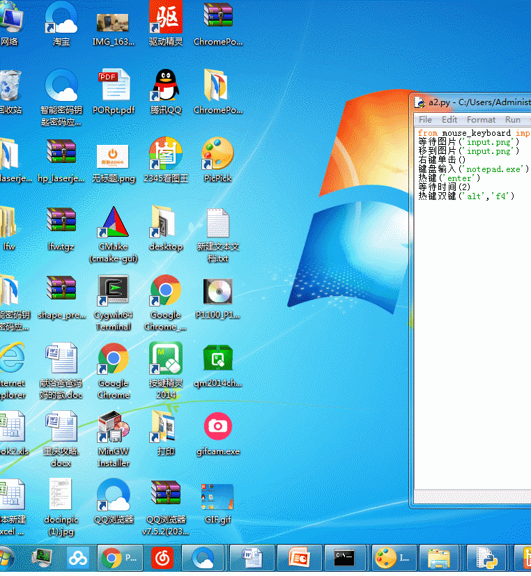

# python_mouse_keyboard
模拟鼠标键盘的操作
基于 python的模块pyautogui和time模块
所以 需要先

#pip install pyautogui


#pip install time


举个例子 
# 先倒入模块， 后面纯中文输入，等待一张图片的出现，出现后鼠标移过去，单击，输入文字，热键等

推荐 使用picpick作为截图工具，存为png格式， 最好不是jpg
```javascript
from mouse_keyboard import *
等待图片('input.png')
移到图片('input.png')
右键单击()
键盘输入('notepad.exe')
热键('enter')
等待时间(2)
热键双键('alt','f4')
```

：

